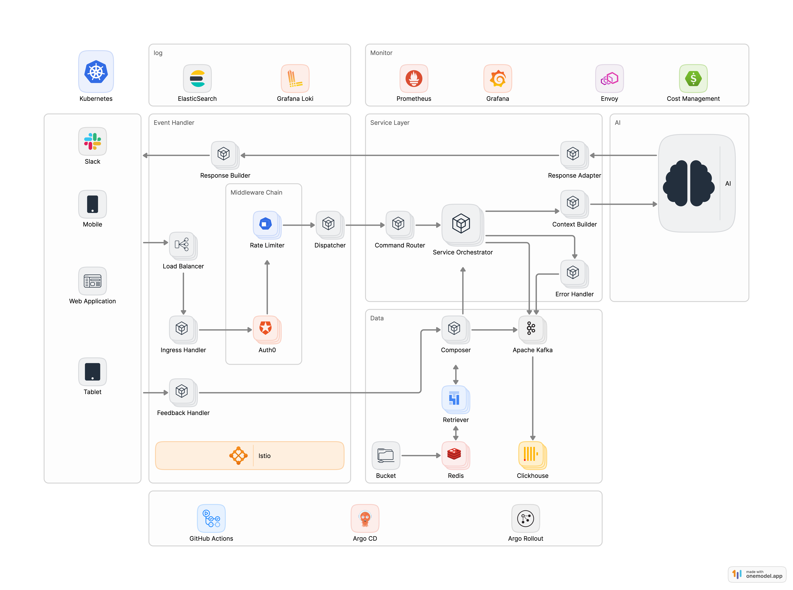

# Slack AI Knowledge Assistant — Architecture & Design

## 1. Problem & Goals
Employees frequently ask repetitive IT questions in Slack (“How do I reset my Okta MFA?”, “Where can I find the latest Workday guide?”).  
The goal is to design a **secure, scalable, observable, and cost-controlled** Slack bot that intelligently answers these questions using local documentation as its knowledge base.

**Objectives**
- Reduce manual IT tickets via self-service (`/ask-it` command)
- Ensure robust authentication, rate-limiting, and auditability
- Demonstrate modular, production-grade system design
- Provide end-to-end observability and FinOps visibility

---

### Architecture Diagram Caption

The diagram below illustrates an **end-to-end AI-powered Slack Knowledge Assistant** built for enterprise-grade security, scalability, observability, and continuous improvement.



**Flow Summary**
1. **Multi-Channel Entry Points** — Slack, Mobile, Web, and Tablet clients send `/ask-it` requests through the Load Balancer managed by **Istio**.
2. **Event Handler Layer** —
    - **Ingress Handler** verifies Slack request signatures.
    - **Auth0** handles authentication and RBAC.
    - **Rate Limiter** enforces per-user and per-channel throttling.
    - **Dispatcher** routes validated events to the **Service Layer**.
3. **Service Layer** —
    - **Command Router** parses commands (`/ask-it`, `/ask-it reload`, `/ask-it stats`).
    - **Service Orchestrator** coordinates retrieval → composition → AI response.
    - **Context Builder** enriches metadata (trace_id, locale, user context).
    - **Error Handler** normalizes failures and fallback paths.
    - **Response Adapter** produces platform-agnostic response payloads.
4. **AI Layer** —
    - Mock or real LLM generates contextual answers based on document snippets.
    - Integrates with **AI Spend Monitoring** (Prometheus + Grafana + ClickHouse) for cost tracking per user/model.
5. **Data Layer** —
    - **Retriever** loads markdown/CSV/JSON files from the **Bucket**, caching results in **Redis**.
    - **Composer** scores and synthesizes relevant snippets.
    - **Apache Kafka** streams logs and feedback asynchronously.
    - **ClickHouse** stores metrics, feedback, and cost data for long-term analytics.
6. **Feedback Handler** — captures Slack 👍/👎 reactions, asynchronously logs them via Kafka → ClickHouse, and supports analytics on helpful rate and KB gaps.
7. **Observability & Monitoring** —
    - **ElasticSearch / Grafana Loki** for structured logs.
    - **Prometheus / Grafana** for metrics, alerting, and FinOps dashboards.
    - **Cost Management** aggregates AI model spend and budget visibility.
8. **Platform & Delivery** —
    - **GitHub Actions** → **Argo CD** → **Argo Rollouts** implement CI/CD and progressive deployment.
    - **Istio** provides zero-trust service mesh, load balancing, and traffic control.

**Key Highlights**
- **Security by design** — Slack HMAC validation, Auth0 RBAC, Istio mTLS
- **Reliability** — stateless microservices, async Kafka writes, Redis caching
- **Observability** — logs + metrics + feedback unified into ClickHouse
- **FinOps-ready** — Prometheus & Grafana dashboards for AI spend tracking
- **Extensible** — multi-channel entry points, pluggable AI & retrievers

---

## 3. End-to-End Flow (A → H)

1. **Slack `/ask-it` Trigger** – user command or simulated webhook event.
2. **Event Handler** – verifies, authenticates, throttles, and routes requests.
3. **Service Layer** – executes business logic, orchestrates retrieval and AI composition.
4. **Retriever & Composer** – fetches and ranks local documents.
5. **AI Layer** – produces contextual natural-language answers (mock or real).
6. **Slack Response** – returns JSON with 👍👎 feedback buttons.
7. **Feedback Handler** – records results to ClickHouse for analysis.
8. **Observability & FinOps** – exposes metrics, logs, and spend data.

---

## 4. Component Breakdown

### Event Handler Layer
- **Ingress Handler**: FastAPI/Bolt endpoint for Slack events
- **Signature Validator**: verifies HMAC-SHA256 + timestamp < 5 min
- **Auth0**: validates identity & Slack → internal user mapping
- **Rate Limiter**: Redis-based token bucket (5 capacity, 0.5/s refill)
- **Dispatcher**: routes commands to handlers
- **Feedback Handler**: receives button callbacks → Kafka → ClickHouse
- **Response Builder**: formats Slack Block Kit message with trace_id and source

### Service Layer
- **Command Router**: `/ask-it reload` / `/ask-it stats` / `/ask-it <query>`
- **Context Builder**: enriches user context and metadata
- **Service Orchestrator**: manages document retrieval, ranking, AI generation
- **Error Handler**: returns templated “System busy / Please retry”
- **Response Adapter**: formats output payloads for multiple platforms

### Data Layer
- **Bucket**: local or cloud storage for markdown/CSV/JSON docs
- **Redis**: in-memory cache for docs and rate-limit tokens
- **Retriever / Composer**: document loader and ranking engine
- **Kafka**: async event stream (feedback, metrics, audit)
- **ClickHouse**: long-term analytical store (feedback, metrics, costs)

### AI Layer
- **Mock Engine**: rule-based, context-aware
- **LLM (optional)**: OpenAI / Azure OpenAI / Bedrock integration
- **Prompt Policy**: “Answer only from context; avoid hallucination”
- **AI Spend Monitor**: exposes cost metrics to Prometheus
    - `ai_tokens_total{user,model}`
    - `ai_cost_usd_total{user,model}`

---

## 5. Security & Governance

| Control Area | Description |
|---------------|--------------|
| **Origin Verification** | Slack signature + timestamp check |
| **Authentication / RBAC** | Auth0 user/group mapping |
| **Rate Limiting** | per-user/channel command bucket |
| **Data Privacy** | context-only answers, no secrets |
| **Secrets Management** | K8s Secrets / Secret Manager |
| **Audit Logging** | trace_id-based structured logs |

---

## 6. Observability & FinOps
- **Logs:** ElasticSearch / Loki (trace_id, latency, confidence, source)
- **Metrics:** Prometheus (requests, latency, helpful_rate, cost)
- **Dashboards:** Grafana (success %, AI cost per model/user)
- **Alerts:** Slack webhooks for latency or cost threshold breaches
- **AI Spend:** Prometheus → ClickHouse → Grafana dashboards
- **Multi-Cluster:** via Thanos/Mimir federation for global view

---

## 7. Reliability & Scaling
- Stateless microservices → scale via Kubernetes HPA
- Shared state via Redis (rate-limit + cache)
- Timeout: AI < 2s; total request < 3s
- Async writes (Kafka → ClickHouse)
- Fallback chain: LLM → Mock → FAQ/Helpdesk CTA
- Blue/green & canary deployment via Argo Rollouts

---

## 8. Data Contracts
**Document**
```json
{ "title": "Okta MFA Reset", "body": "Steps...", "source": "okta/okta_mfa.md",
  "updated_at": "2025-11-01T09:00:00Z", "tags": ["okta","mfa"], "weight": 1.0 }
```

AnswerPayload
```json
{ "trace_id": "abc123", "answer": "To reset your Okta MFA...",
  "sources": ["okta/okta_mfa.md"], "confidence": 0.92 }
```

Feedback
```json
{ "trace_id": "abc123", "user_id": "U123", "helpful": true,
  "ts": "2025-11-01T21:12:33Z" }
```

AI Spend
```json
{ "trace_id": "abc123", "user": "U123", "model": "gpt-4o-mini",
  "tokens_prompt": 320, "tokens_completion": 210, "cost_usd": 0.00106 }
```
## 9. 🧪 Local Run & Testing Guide

### 9.1 Quick Start (Mock Mode — No External Dependencies)
```bash
python -m venv .venv
source .venv/bin/activate
pip install -r requirements.txt
export SLACK_SIGNING_SECRET=dev-secret
export REDIS_URL=redis://localhost:6379/0
python -m uvicorn app:app --reload --port 8080
```

### 9.2 Test Commands

**Health check**
```bash
curl http://127.0.0.1:8080/health
```

**Ask a question**
```bash
curl -X POST http://127.0.0.1:8080/ask-it -H "Content-Type: application/json" -d '{"user":"U123","channel":"C1","text":"reset Okta MFA"}'
```

**Reload document cache**
```bash
curl -X POST http://127.0.0.1:8080/ask-it -H "Content-Type: application/json" -d '{"user":"U123","channel":"C1","text":"reload"}'
```

**Send feedback**
```bash
curl -X POST http://127.0.0.1:8080/feedback -H "Content-Type: application/json" -d '{"trace_id":"abc123","helpful":true}'
```

**Check metrics**
> 🧩 Note: `/metrics` exposes real Prometheus telemetry (requests, latency, feedback, token cost).

```bash
http://127.0.0.1:8080/metrics
```

## 10. Summary

This design delivers:

- Security – validated ingress, Auth0 RBAC, rate-limiting

- Scalability – stateless microservices, async Kafka, Redis cache

- Observability – logs, metrics, feedback analytics

- FinOps Readiness – AI spend metrics integrated with Grafana

- Extensibility – pluggable retrievers, AI models, and new channels

A production-ready blueprint demonstrating engineering depth, observability maturity, and cost accountability — the qualities of a world-class enterprise Slack Assistant.